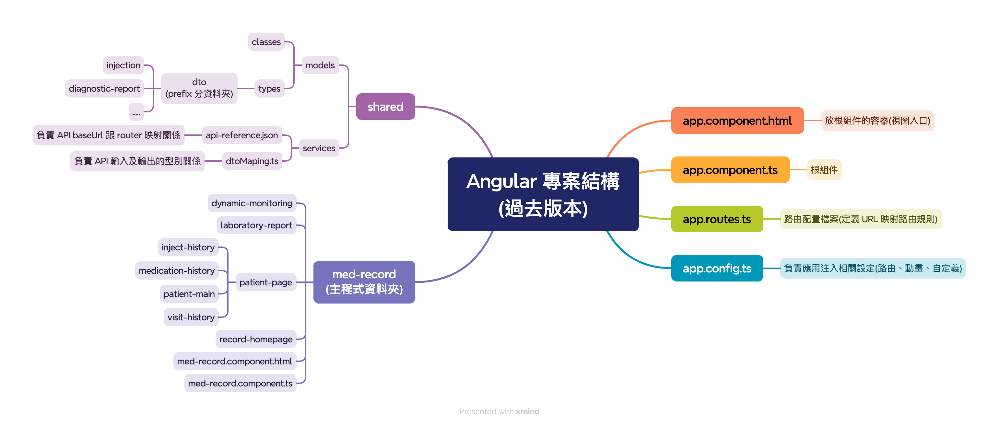
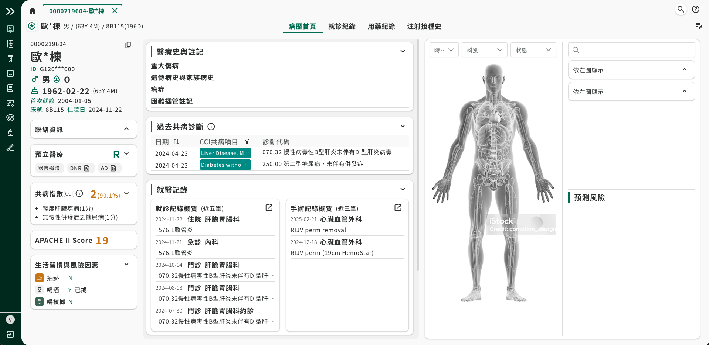
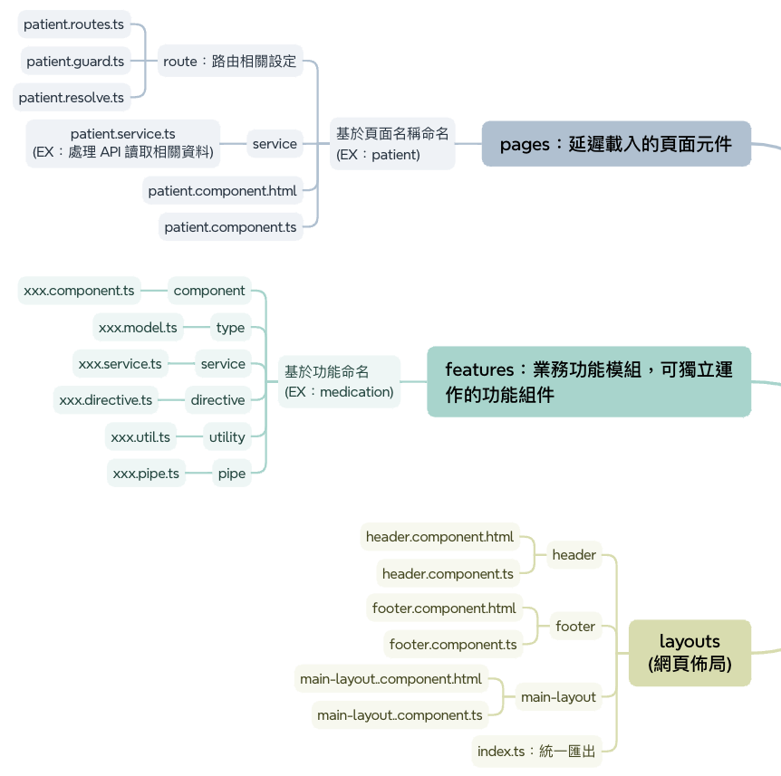
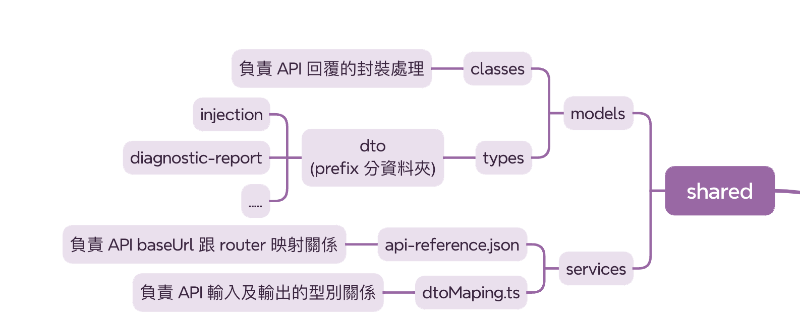
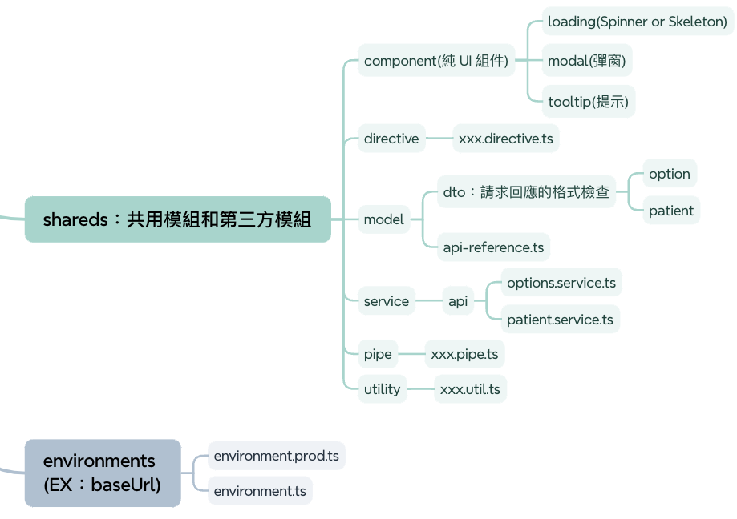
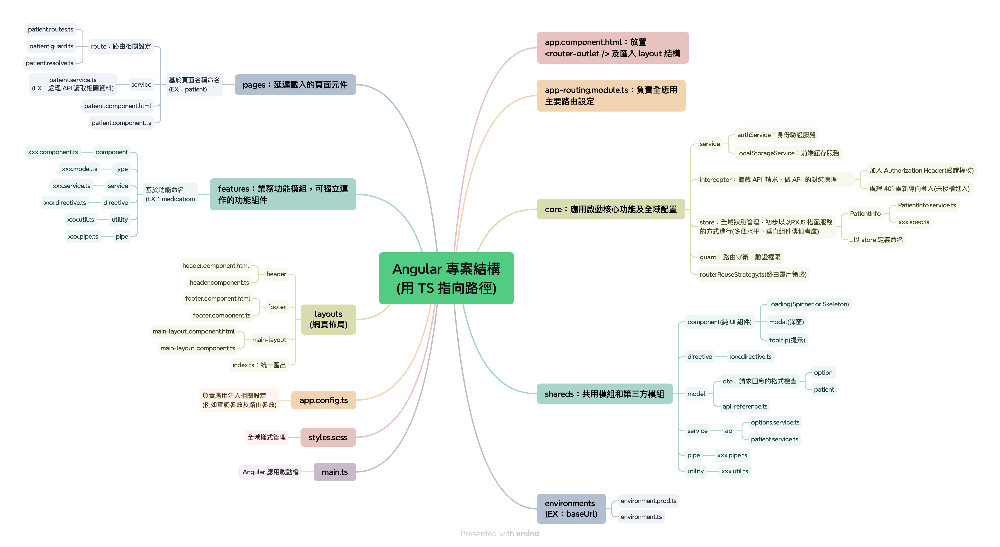

# 前端的架構討論

<div class="abs-br m-6 text-xl">
  <a href="https://gitlab.aservice.com.tw/hepiuscare/frontend/apps/hepius-record" target="_blank" class="slidev-icon-btn">
    <carbon:logo-github />
  </a>
</div>
---
layout: full
---

## 議題討論(以 Vita 實作議題切入)

- Vita 遇到了什麼架構上的問題
  - 議題一：頁面組件與功能組件分類紊亂
  - 議題二：佈局組件與頁面組件職責混雜
  - 議題三：路由核心功能 & 全域狀態放置位置模糊
  - 議題四：Share 定義 & api-reference 管理困難
- Vita 實作的優化建議

<style>
ul{
  padding: 1rem;
}
</style>

---

# Vita 遇到了什麼架構上的問題？

<v-clicks every="1" class="full-height mt-5 flex gap-1.2 flex-col text-[1.4rem]">

- 頁面與功能組件分類紊亂：：
  - 難以明確區分**頁面組件** 與 **功能組件**，增加新成員的學習與接手成本。
- 佈局與頁面組件職責混雜：
  - **網頁佈局(Layout)** 組件與頁面組件的職責界線模糊，影響開發者專注於單一組件的功能開發。
- 缺乏健全路由管理：
  - 大量使用 **動態組件**，導致組件間耦合度高，狀態管理複雜。
  - 路由核心功能如**resolve(資料預載)**、**guard(路由守衛)**、**store(全域狀態)** 及 **interceptors(攔截器)** 缺乏統一明確的定義位置。
- api.reference.json 開發困境：
  - **端點(Endpoint)** 與 **型別(Type)分離定義**，降低 API 功能的辨識度。

</v-clicks>

<style>
strong {
  color: #D79B00;
}
</style>

---

# 過去版本 Vita 專案架構圖

<v-click>
 
</v-click>

<style>
.slidev-layout h1 + p {
  opacity: 1;
}

img{
  padding-bottom: 1rem;
}
</style>

---
layout: center
---

# 議題一：頁面組件與功能組件分類紊亂

---
layout: image-right
image: '/oldArchitecture01.png'
backgroundSize: 'contain'
---

# 主程式結構

### 頁面組件 {.section-spacing}
> - 定義：構成應用程式的頂層容器，直接對應路由系統，負責構建完整的頁面視圖
> - 目的：
>   - 作為應用程式的入口點，處理路由切換與頁面級狀態管理
>   - 整合並協調多個功能組件，呈現完整的用戶介面和體驗

### 功能組件 {.section-spacing}
> - 定義：頁面組件內部的最小可重用單元，專注於實現特定功能或 UI 區塊，無法獨立作為完整頁面顯示。
> - 目的：
>   - 單一職責原則，專注於特定的功能邏輯或 UI 呈現
>   - 提高組件**可重用性(Reusability)** ，減少重複開發

<style>
.section-spacing {
  margin: 1rem auto 1rem auto;
}
</style>

---
layout: image
---

# patient-page or record-homepage 誰是頁面組件？



---
layout: center
---

# 議題二：佈局組件與頁面組件職責混雜

---
layout: image-right
image: '/layout.png'
backgroundSize: 'contain'
class: items-center
---

# Layout 佈局不固定

**以 Vita 專案為例，layout 層應該發揮的作用**
- 路由管理：負責`router-outlet(路由出口)`的包裝與導航控制
- 佈局組件整合：統一管理 navbar、sidebar 等全域性佈局元素(即每個頁面都會出現的共用元件)。
- 全域狀態協調：處理跨頁面共享的應用程式狀態

<hr />

架構優化建議
```
搭配 tsconfig paths 設定 @features、@pages、@layouts、@shared 等路徑別名
強化引用來源的語意表達，避免使用相對路徑的複雜引用方式。
```

<style>
ul{
  display: flex;
  flex-direction: column;
  gap: 1rem
}
</style>
---
layout: two-cols
---

## main.layout

```html
<div>
  <app-nav-menu />
</div>
<div>
  <header class="pl-0.5">
    <app-header />
  </header>
  <main class="flex-1 overflow-hidden">
    <div class="h-full">
      <router-outlet></router-outlet>
    </div>
  </main>
</div>
```

::right::

## app.route.ts

```ts {*}{maxHeight:'80%'}
export const routes: Routes = [
  {
    path: 'sign-in',
    title: '登入',
    loadComponent: () => import('@pages/sign-in/sign-in.component').then((m) => m.SignInComponent),
  },
  {
    path: 'main',
    loadComponent: () => import('@core/layouts/main-layout/main-layout.component').then((m) => m.MainLayoutComponent),
    canActivate: [AuthenticatedGuard],
    children: [
      {
        path: '',
        title: '整合病歷系統首頁',
        data: { reuse: true },
        loadComponent: () =>
          import('@pages/record-homepage/record-homepage.component').then((m) => m.RecordHomepageComponent),
      },
      // ...略
    ],
  },
  {
    path: '**',
    redirectTo: 'sign-in',
  },
];
```

<style>
.slidev-layout{
  gap: 2rem;
}

h2{
  padding-bottom: .75rem;
}
</style>

---
layout: default
---

<div class="grid grid-cols-2 gap-4 items-start pt-1">
  <div class="text-center">
    <h2 class="pb-4">舊架構分類方式</h2>
    
  </div>
  <div class="text-center">
    <h2 class="pb-4">新架構分類方式</h2>
    
  </div>
</div>


---
layout: center
---

# 議題三：路由核心功能 & 全域狀態放置位置模糊

---
layout: two-cols
---

## 為什麼要使用路由管理組件？ 
- **效能優化**：透過 lazy-loading 機制，能夠顯著降低應用程式的首次載入時間(First Contentful Paint, FCP)，提升整體使用者體驗。 
- **安全性**：權限管控的路由生命週期發生在組件初始化之前，相較於進入組件後再做檢查更安全且合理  
- **用戶體驗**：能夠預先加載初始化所需資料，並且記錄使用者的導覽歷程

::right::

```ts {all|1-9|11-17|19-25|all}{maxHeight:'100%'}
const routes: Routes = [
  {
    path: 'admin',
    loadComponent: () =>
      import('./admin/admin.component').then((m) => m.AdminComponent),
    canActivate: [AuthGuard],
    resolve: { initData: AdminResolver }
  }
];

// 權限守衛
@Injectable()
export class AuthGuard implements CanActivate {
  canActivate(): boolean {
    return this.authService.isAuthorized();
  }
}

// 資料預載 Resolver
@Injectable()
export class AdminResolver implements Resolve<InitData> {
  resolve(): Observable<InitData> {
    return this.adminService.fetchInitData();
  }
}
```

<style>
ul{
  padding: 2rem 1rem 0 0;
  display: flex;
  flex-direction: column;
  gap: 1rem
}
</style>

---
layout: center
---

# 不使用路由進行懶加載會怎麼做？

---
layout: two-cols
class: items-center
---

### 方法一：async import + viewchildRef + ngcomponentOutlet {.text-center}
```ts
import type { HelloComponent } from './hello.component';

@Component({
  selector: 'app-host',
  template: `
    <ng-container
      [ngComponentOutlet]="lazyComponent"
      [ngComponentOutletInputs]="{}">
    </ng-container>
  `
})
export class HostComponent implements OnInit {
  lazyComponent: Type<HelloComponent> | null = null;

  async ngOnInit(): Promise<void> {
    const { HelloComponent: LoadedHelloComponent } = await import('./hello.component');
    this.lazyComponent = LoadedHelloComponent;
  }
}
```
<a href="https://stackblitz.com/edit/stackblitz-starters-jdf2kb9a?file=src%2Fmain.ts">stackblitz 連結</a>

::right::

### 方法二：async import + viewchildRef + viewchildContainer {.text-center}
```ts
import type { HelloComponent } from './hello.component';

@Component({
  selector: 'app-host',
  template: `<ng-container #vc></ng-container>`,
})
export class HostComponent implements OnInit {
  @ViewChild('vc', { read: ViewContainerRef, static: true })
  private vcr!: ViewContainerRef;
  private componentRef?: ComponentRef<HelloComponent>;

  async ngOnInit(): Promise<void> {
    const module = await import('./hello.component');
    const componentType: Type<HelloComponent> = module.HelloComponent;
    this.componentRef?.destroy();
    this.vcr.clear();
    this.componentRef = this.vcr.createComponent(componentType);
  }
}
```

<a href="https://stackblitz.com/edit/stackblitz-starters-pj9b5r7a?file=src%2Fmain.ts">stackblitz 連結</a>

<style>
.slidev-layout{
  gap: 2rem;
}
</style>

---
layout: image-right
image: '/core.png'
backgroundSize: 'contain'
class: items-center
---

## core 定義系統啟用必要資訊

- 🎯 初始化時需載入的所有功能 {.section-spacing}
  - 例如：日誌系統、全域攔截器、權限驗證、設定檔讀取等
- 🎯 服務採用 Singleton 單例模式 {.section-spacing}
  - 確保在整個應用生命週期內僅建立一份實例
  - 例如：身份驗證服務、前端緩存服務(Local/Session Storage)

<a href="https://stackblitz.com/edit/stackblitz-starters-evrypbwv?file=package.json">stackblitz 連結(store 的三種初步構想)</a>

<style>
.section-spacing{
  margin-top: 2rem;
  display: flex;
  flex-direction: column;
  gap: 1rem
}
</style>

---
layout: center
---

# 議題四：Share 資料夾調整 & api-reference 管理困難

---
class: items-center
---

<h2>share 架構調整統一管理 api 資訊</h2>

<div class="grid grid-cols-2 gap-4 items-start pt-1">
  <div class="text-center">
    <h3 class="pb-4">1. 舊架構分類方式</h3>
    
  </div>
  <div class="text-center">
    <h3 class="pb-4">2. 新架構分類方式</h3>
    
  </div>
</div>

<style>
h2{
  padding-bottom: 2rem;
}
</style>

---
layout: two-cols
class: items-center
---

### API 資訊統一維護管理

👉 統一放在 api 資料夾 + environments 中集中管理

- **優點** {.section-spacing}
  - 維護集中，適合團隊短時間內快速變動需求
  - 可辨識度高，能一眼識別**端點位置**及**input & output 參數**
- **缺點** {.section-spacing}
  - 耦合度較高，修改端點時會牽動多個模組，降低彈性

::right::

### API 資訊分散式管理

👉 放在各自 features 底下由各模組自行管理

- **優點** {.section-spacing}
  - 每個 feature 的所有 API 定義都集中在同一個資料夾內，使用者可快速掌握該功能所需的所有資訊
  - 獨立性更強：單一功能變更時，只需在該 feature 資料夾修改，不影響其他模組
- **缺點** {.section-spacing}
  - 重複定義風險：不同 feature 可能會重複定義相似的 DTO 或參數
  - 可辨識度略低：開發者需切換到各個 feature 資料夾才能看到完整的 API 架構，搜尋成本較高


<style>
.section-spacing{
  margin-top: 1rem;
  display: flex;
  flex-direction: column;
  gap: .5rem;
  color: #ccc;
}

strong{
  color: #D79B00;
}
</style>

---
layout: two-cols
---

# HttpService 優化方案

- 維持 HttpService 方式，但讓**uri**跟**型別**統一定義 {.section-spacing}
> 問題：目前拆開定義需要兩個步驟，容易造成識別困難
> Step 1. api-reference.json + Step 2. dtoMapping

- 使用環境設定統一管理關於 baseUrl 的部分 {.section-spacing}
> - 對於 CI/CD 友善，可直接透過環境變數動態調整
> - 對於開發者也不需要擔心測試及正式 baseUrl 的修改，不小心 push 上去

<hr />

- ❗隱憂：
> - url 是否考量多個路由參數
> - 請求本身是否會考量自定義標頭

::right::

<div class="pt-9"></div>

```ts
//... 略
const option = {
  searchSections: generateApi<unknown, SectionDto[]>({ uri: 'options/sections' }),
  searchNursingStations: generateApi<unknown, autoCompleteSelections[]>({ uri: 'options/nursing-station' }),
  searchDoctorsBySections: generateApi<unknown, autoCompleteSelections[]>({ uri: 'options/doctor' }),
  searchInpatientSections: generateApi<unknown, autoCompleteSelections[]>({ uri: 'options/inpatient-section' }),
  searchPartitioners: generateApi<unknown, autoCompleteSelections[]>({ uri: 'options/partitioner' }),
};
const authInfo = { host: authHost };
const mainInfo = {
  host,
  endpoint: {
    ...patient,
    ...nursing,
    ...encounter,
    ...option,
  },
};

// 原先 dtoMapping 的部分
export type OptionDto = ExtractApiTypes<typeof option>;
```

<style>
ul{
  padding-bottom: .5rem;
}

hr{
  margin: 1rem 0 1rem 0;
}

li{
  padding-bottom: .5rem;
}

strong{
  color: #D79B00;
}

.slidev-layout{
  gap: 2rem;
}
</style>

---
layout: center
---

---

# 修改後版本 Vita 專案架構圖

<v-click>
 
</v-click>

<style>
.slidev-layout h1 + p {
  opacity: 1;
}

img{
  padding-bottom: 1rem;
}
</style>

# Vita 實作的優化建議

---
layout: "center"
---

- **優化建議一：RXJS 原生的 switchMap 能自動 abort（中止請求）**  
> - 如果使用原生 `fetch`，必須自己建立 `AbortController`，並在需要取消請求時呼叫 `controller.abort()`。  
> - 建議：在 Angular 裡，如果需要持續監聽事件，並且在事件觸發時發出 HTTP 請求，透過 `switchMap`請求。當訂閱（subscribe）被取消時，RxJS 會自動中止底層請求。

- **優化建議二：避免在 Template 中直接呼叫函數**  
> - 在 Angular 的變更偵測機制中，模板中的函數會在每次變更檢測時重新執行
> - 建議：我目前僅想得到`computed signal`可以解決這個問題，如果有其他方式可以補充提供，否則僅能透過`OnPush`減少變更偵測的次數。
::right::

<div class="pt-9"></div>

```ts
this.#route.paramMap
.pipe(
  takeUntilDestroyed(),
  switchMap((params) => {
    const patientId = params.get('patientId')!;
    return this.#fetchHandover(patientId);
  }),
)
.subscribe({
  next: (handoverRecord) => {
    console.log('取回響應值', handoverRecord)
  },
  error: () => console.error('載入交班資訊失敗'),
});
```

<style>

.slidev-layout .col-right{
  align-self: center;
}

ul{
  padding: 1rem 0 0 0;
}

</style>


---
layout: full
---

# RXJS 原生的 switchMap 能自動 abort（中止請求）

搭配網路環境速率**3G**，模擬延遲產生的情形


---
layout: center
---

# 感謝大家的參與